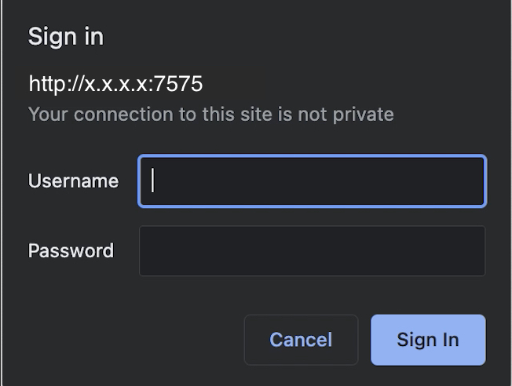
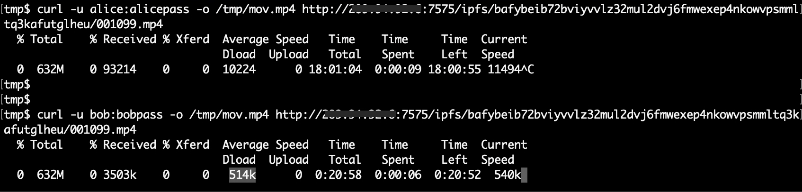

# Advanced Configuration of booster-http


Before proceeding any further, we suggest you read about the [basics of HTTP retrieval with booster-http](http-retrieval.md). This section is an extension of HTTP retrievals and deals with advanced configuration options.


## Configuration options

`booster-http` is an independent process that can be run on the same machine as `boostd` or on a different machine. Multiple instances can also be run with different listen addresses if required.

```
   --pprof                                                  run pprof web server on localhost:6070 (default: false)
   --base-path value                                        the base path at which to run the web server
   --address value, --addr value                            the listen address for the web server (default: "0.0.0.0")
   --port value                                             the port the web server listens on (default: 7777)
   --api-lid value                                          the endpoint for the local index directory API, eg 'http://localhost:8042'
   --add-index-throttle value                               the maximum number of add index operations that can run in parallel (default: 4)
   --api-fullnode value                                     the endpoint for the full node API
   --api-storage value [ --api-storage value ]              the endpoint for the storage node API
   --serve-pieces                                           enables serving raw pieces (default: true)
   --serve-cars                                             serve CAR files with the Trustless IPFS Gateway API (default: true)
   --compression-level value                                compression level to use for responses, 0-9, 0 is no compression, 9 is maximum compression; set to 0 to disable if using a reverse proxy with compression (default: 1)
   --log-file value                                         path to file to append HTTP request and error logs to, defaults to stdout (-) (default: "-")
   --tracing                                                enables tracing of booster-http calls (default: false)
   --tracing-endpoint value                                 the endpoint for the tracing exporter (default: "http://tempo:14268/api/traces")
   --api-filter-endpoint value                              the endpoint to use for fetching a remote retrieval configuration for requests
   --api-filter-auth value                                  value to pass in the authorization header when sending a request to the API filter endpoint (e.g. 'Basic ~base64 encoded user/pass~'
   --badbits-denylists value [ --badbits-denylists value ]  the endpoints for fetching one or more custom BadBits list instead of the default one at https://badbits.dwebops.pub/denylist.json (default: "https://badbits.dwebops.pub/denylist.json")
   --help, -h                                               show help
```

### booster-http, boostd and lotus

`booster-http` must have network, or localhost access to a full `lotus` node, a `lotus-miner` and a `boostd` instance. The following options are required:

* `--api-lid` - the `boostd` Local Index Directory (_LID_)
* `--api-fullnode` - the `lotus` full node API endpoint, discoverable by running `lotus auth api-info --perm=admin`
* `--api-storage` - the `lotus-miner` API endpoint, discoverable by running `lotus-miner auth api-info --perm=admin`

### Address and port

`--address` and `--port` configure the listen address and port of the `booster-http` server. By default HTTP server will listen on `0.0.0.0:7777`. This can be set to other addresses and ports as required, e.g. `127.0.0.1` to serve localhost-only if running a reverse-proxy on the same server with a public listen address.

### Pieces and CARs

`--serve-pieces` is enabled by default and allows retrieval of raw pieces on the `/piece/` endpoint of your `booster-http` server. Requests for pieces require the full piece CID appended to `/piece/`.

Piece retrieval is typically performed to replicate deals, or by clients that are able to decode raw piece data.

`--serve-cars` is enabled by default and allows [IPFS Trustless Gateway](https://specs.ipfs.tech/http-gateways/trustless-gateway/) retrievals on the `/ipfs/` endpoint. This is not a full "trusted" gateway, and requests must either ask for CARs containing one or more blocks from a root CID, or raw block bytes for a single CID. Requests can either pass an `Accept: application/vnd.ipld.car` header, or a `?format=car` query parameter for CAR data. Or, to download raw single IPLD block bytes, either an `Accept: application/vnd.ipld.raw` header, or a `?format=raw` query parameter.

A trustless retrieval client is recommended for performing and verifying retrievals from `booster-http`. See [Lassie](https://github.com/filecoin-project/lassie) for more information. Providing Lassie with the `--provider http://{SP's HTTP retrieval URL}` will perform verified, trustless retrievals to your `booster-http` instance.

### BadBits denylist

`booster-http` (and `booster-bitswap`) automatically filter out known flagged content using the denylist maintained at [https://badbits.dwebops.pub/denylist.json](https://badbits.dwebops.pub/denylist.json). Use one or more `--badbits-denylists` flags to point to a custom, valid BadBits denylist and override the default.

### Compression

By default, `booster-http` will compress responses with gzip compression. `--compression-level` can be set between values of `0` and `9`, where `0` is no compression and `9` is maximum compression. The default value is `1`, which optimises for speed over compression ratio but this may be increased if required.

Compression can be disabled by setting `--compression-level 0`. If you are running a reverse proxy, such as NGINX, in front of `booster-http` that performs compression, you should disable compression in `booster-http` to avoid double-compression.

### Logging

`booster-http` logs HTTP requests and errors to stdout by default. This can be overridden with `--log-file` to log to a file instead. The log file format is similar to typical NGINX or Apache log file formats and is suitable for ingestion into log aggregation tools such as Splunk or ELK. The format is as follows:

```
%s %s %s "%s" %d %d %d %s "%s" "%s"
```

Where the elements are:

1. RFC 3339 timestamp
2. Remote address
3. HTTP Method
4. Request path
5. Response status code
6. Response duration (in milliseconds)
7. Response size
8. Compression ratio (or `-` if no compression)
9. Remote user agent
10. Error (or `""` if no error)

When using a reverse proxy, log output from the reverse proxy may be more suitable for storage and analysis than `booster-http` logging.

## Trusted HTTP Gateway Setup

Where a Storage Provider wishes to serve plain files, including streaming video, audio and other media, a trusted HTTP gateway can be used to translate `booster-http`'s trustless data into trusted data. This is a separate process that must be configured to communicate with `booster-http`.

Be aware that trusted HTTP responses typically do not count as "successful" retrievals by reputation systems and other retrieval checkers. It is also not possible to use trusted HTTP gateways to retrieve CAR files, which are required for verified retrievals by clients such as [Lassie](https://github.com/filecoin-project/lassie) which is a recommended client for Filecoin downloads. When enabling trusted HTTP gateways, it is recommended to also enable the trustless CAR gateway to allow CAR retrievals; this includes via reverse proxies (see below).

### bifrost-gateway

[bifrost-gateway](https://github.com/ipfs/bifrost-gateway) is an IPFS Trusted Gateway server that can be used to translate `booster-http`'s trustless data into trusted data. bifrost-gateway is a separate process that must be configured to communicate with `booster-http`.

When running `bifrost-gateway`, two environment variables must be set:

* `PROXY_GATEWAY_URL=http://{SP's HTTP retrieval URL}` to point to the `booster-http` address (without path)
* `GRAPH_BACKEND=true` to instruct `bifrost-gateway` to perform full CAR retrievals rather than individual IPLD block retrievals for efficiency

Additionally, `--gateway-port` may be used to override the default listen port of `8081`.

```sh
PROXY_GATEWAY_URL=http://localhost:7777 GRAPH_BACKEND=true bifrost-gateway
```

```sh
curl --output /tmp/museum.jpg "http://localhost:8081/ipfs/bafybeidqindpi4ucx7kmrtnw3woc6jtl7bqvyiokrkpbbuy6gs6trn57tm/vincent/Vincent%20van%20Gogh_files/Caf%C3%A9tafel_met_absint_-_s0186V1962_-_Van_Gogh_Museum.jpg"
  % Total    % Received % Xferd  Average Speed   Time    Time     Time  Current
                                 Dload  Upload   Total   Spent    Left  Speed
100 11830  100 11830    0     0   140k      0 --:--:-- --:--:-- --:--:--  175k

open /tmp/museum.jpg
```

A reverse proxy can be configured to talk to `bifrost-gateway`, but be aware that IPFS gateway's are typically exposed on the `/ipfs/` endpoint, which is also the endpoint of the trustless gateway which is required for standard Filecoin retrievals (e.g. using [Lassie](https://github.com/filecoin-project/lassie)). A reverse proxy combining both the `booster-http` trustless endpoint and a `bifrost-gateway` trusted endpoint must be configured to route `/ipfs/` requests to `booster-http` where the `Accept` header contains `application/vnd.ipld.car` or `application/vnd.ipld.raw`, and `/ipfs/` requests to `bifrost-gateway` where the `Accept` header contains anything else, such as `text/html` or `*/*`. Alternatively, separate reverse proxies may be configured for both `booster-http` and `bifrost-gateway`.

## Reverse Proxy Setup

Storage Providers should secure their `booster-http` before exposing it to the public. Storage Providers may use any tool available to limit who can download files, the number of requests per second, and the download bandwidth each client can use per second.

[NGNIX](https://nginx.org/en/docs/) is one such reverse proxy which may be used in front of a `booster-http` instance. This section provides only a basic coverage of the ways in which NGINX can set access limits, rate limits and bandwidth limits. In particular it’s possible to add limits by request token, or using JWT tokens. The examples in this section are adapted from [Deploying NGINX as an API Gateway](http://nginx.com/blog/deploying-nginx-plus-as-an-api-gateway-part-1) which goes into more detail.

By default NGINX puts configuration files into `/etc/nginx`

The default configuration file is `/etc/nginx/sites-available/default`

### Setup server block

In this example, we are setting up an NGINX server listen on port `7575` and forward requests to `booster-http` on port `7777`.

The IPFS Trustless Gateway serves content from `/ipfs/` and the piece retrieval endpoint is `/piece/`. A `location` block that matches both of these paths will forward requests to `booster-http`.

```
# ipfs gateway config
server {
        listen 7575 default_server;
        listen [::]:7575 default_server;

        location ~* ^/(ipfs|piece)/ {
                proxy_pass http://127.0.0.1:7777;
        }
}
```

Alternatively, to only forward `/ipfs/` requests to `booster-http` our `location` directive can be simplified:

```
        location /ipfs/ {
                proxy_pass http://127.0.0.1:7777;
        }
```

### Limiting Access

We can limit access to the IPFS gateway using the standard `.htaccess` file. This file contains usernames and passwords. In this example we create a user named _`alice`_:

```
$ mkdir /etc/nginx/ipfs-gateway.conf.d

$ htpasswd -c /etc/nginx/ipfs-gateway.conf.d/.htpasswd alice
New password:
Re-type new password:
Adding password for user alice
```

Include the `.htaccess` file in the `/etc/nginx/sites-available/default`

```
 # ipfs gateway config
server {
        listen 7575 default_server;
        listen [::]:7575 default_server;

        location ~* ^/(ipfs|piece)/ {
                # htaccess authentication
                auth_basic "Restricted Server";
                auth_basic_user_file /etc/nginx/ipfs-gateway.conf.d/.htpasswd;
                proxy_pass http://127.0.0.1:7777;
        }
}
```

Now when we open any URL under the path `/ipfs/` we will be presented with a _Sign-in_ dialog.

<figure><figcaption><p>Login prompt when accessing `booster-http` url</p></figcaption></figure>

### Rate Limiting

To prevent users from making too many requests per second, we can add rate limits.

1. Create a file with the rate limiting configuration at `/etc/nginx/ipfs-gateway.conf.d/ipfs-gateway.conf`
2. Add a request zone limit to the file of 1 request per second, per client IP

```
limit_req_zone $binary_remote_addr zone=client_ip_10rs:1m rate=1r/s;
```

3. Include `ipfs-gateway.conf` in `/etc/nginx/sites-available/default` and set the response for too many requests to _HTTP response code 429_

```
include /etc/nginx/ipfs-gateway.conf.d/ipfs-gateway.conf;
server {
        listen 7575 default_server;
        listen [::]:7575 default_server;

        location ~* ^/(ipfs|piece)/ {
                # htaccess authentication
                auth_basic "Restricted Server";
                auth_basic_user_file /etc/nginx/ipfs-gateway.conf.d/.htpasswd;

                limit_req zone=client_ip_10rs;
                limit_req_status 429;
                proxy_pass http://127.0.0.1:7777;
        }
}
```

1. Click the refresh button in your browser on any path under `/ipfs/` more than once per second you will see a 429 error page.

<figure><figcaption><p>HTTP error 429</p></figcaption></figure>

### Bandwidth Limiting

It is also recommended to limit the amount of bandwidth that clients can take up when downloading data from `booster-http`. This ensures a fair bandwidth distribution to each client and prevents situations where one client ends up choking the `booster-http` instance.

1. Create a new .htaccess user called _`bob`_

```
$ htpasswd /etc/nginx/ipfs-gateway.conf.d/.htpasswd bob
```

2. Add a mapping from `.htaccess` username to bandwidth limit in `/etc/nginx/ipfs-gateway.conf.d/ipfs-gateway.conf`

```
map $remote_user $bandwidth_limit {
    default  1k;
    "alice"  10k;
    "bob"    512k;
}
```

3. Add the bandwidth limit to `/etc/nginx/sites-available/default`

```
include /etc/nginx/ipfs-gateway.conf.d/ipfs-gateway.conf;
server {
        listen 7575 default_server;
        listen [::]:7575 default_server;

        location ~* ^/(ipfs|piece)/ {
                # htaccess authentication
                auth_basic "Restricted Server";
                auth_basic_user_file /etc/nginx/ipfs-gateway.conf.d/.htpasswd;

                limit_rate $bandwidth_limit;

                limit_req zone=client_ip_10rs;
                limit_req_status 429;
                proxy_pass http://127.0.0.1:7777;
        }
}
```

4. To verify bandwidth limiting, use `curl` to download a file with user _`alice`_ and then _`bob`_\
   Note the difference in the Average Dload column (the average download speed).

<figure><figcaption><p>Bandwidth limiting result</p></figcaption></figure>

### Compression

We can configure NGINX's compression settings in its main `http` block, typically in the `/etc/nginx/nginx.conf` file.

```
http {
    ...
    gzip on;
    gzip_vary on;      # Add Vary: Accept-Encoding header
    gzip_proxied any;  # Compress data for all proxied requests
    ...
}
```

See the [NGINX gzip module documentation](https://nginx.org/en/docs/http/ngx_http_gzip_module.html) for more information.

### HTTPS

NGINX can be configured to serve HTTPS traffic. This is recommended for production deployments. See [NGINX HTTPS configuration](https://nginx.org/en/docs/http/configuring_https_servers.html) for more information.

### Caching

NGINX can be configured to cache responses from `booster-http`. Since `booster-http` serves content addressed data that does not change, this is particularly well suited to caching in cases where certain content is frequently requested. `booster-http` sets a long `Cache-Control` header by default, so NGINX will cache responses for a long time by default.

See the [NGINX proxy module](https://nginx.org/en/docs/http/ngx_http_proxy_module.html) documentation for more information on how to configure caching.
