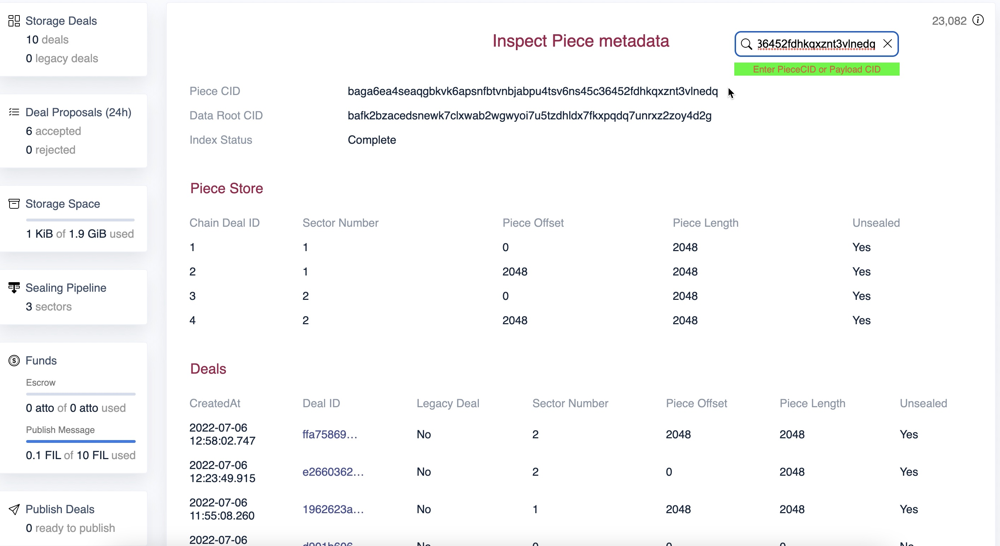

# Troubleshooting

## Inspect

The new boost inspect page in the UI to help debug problems with retrievals. It allows the users to check the following using a payload CID or piece CID

* Inspect allows you to look up a piece by piece CID or payload CID and verify if the piece has been correctly added to the Piece Store
* If the piece has been indexed in the DAG store
* Do we have an unsealed copy of the piece
* The payload CID -> piece CID index has been created correctly



## Failed to connect to peer

If the client cannot connect to Boost running on a Storage provider, with an error similar to the following:

```
failed to connect to peer <peer id>: failed to dial <peer id>:
  * <multi-address> failed to negotiate security protocol:
    peer id mismatch: expected <peer id>,
    but remote key matches <different peer id>
```

The problem is that:

* The SP registered their peer id and address on chain.

&#x20;      eg "Register the peer id `123abcd` at address `ip4/123.456.12.345/tcp/1234`"

```
lotus-miner actor set-peer-id 123abcd
lotus-miner actor set-addrs ip4/123.456.12.345/tcp/1234
```

* The SP changed their peer id locally but didn't update the peer id on chain.
* The client wants to make a storage deal with peer `123abcd`. The client looks on chain for the address of peer `123abcd` and sees peer `123abcd` has registered an address `ip4/123.456.12.345/tcp/1234`.
* The client sends a deal proposal for peer `123abcd` to the SP at address `ip4/123.456.12.345/tcp/1234`.
* The SP has changed their peer ID, so the SP responds to the deal proposal request with an error: `peer id mismatch`

To fix the problem, the SP should register the new peer id on chain:

```
lotus-miner actor set-peer-id <new peer id>
```

### Error in _lotus-miner info_ output

After migrating to Boost, following error is seen when running `lotus-miner info` :

```
ERROR: fatal error calling 'Filecoin.MarketListIncompleteDeals': panic in rpc method 'Filecoin.MarketListIncompleteDeals': runtime error: invalid memory address or nil pointer dereference
```

#### Problem:

`lotus-miner` is making a call on `lotus-market` process which has been replaced by Boost. But, `lotus-miner` command is not aware of the new market process.

#### Solution:

Export the `LOTUS_MARKET_PATH` variable on your lotus-miner node.

```
export LOTUS_MARKETS_PATH=<BOOST REPO PATH>
```

