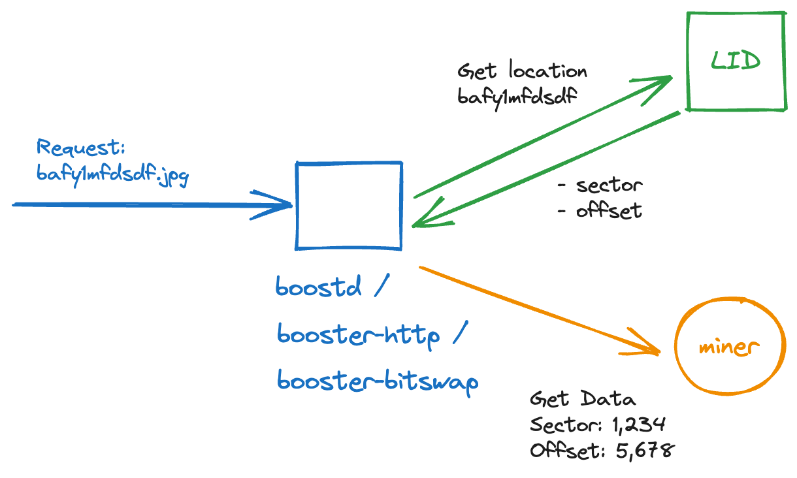
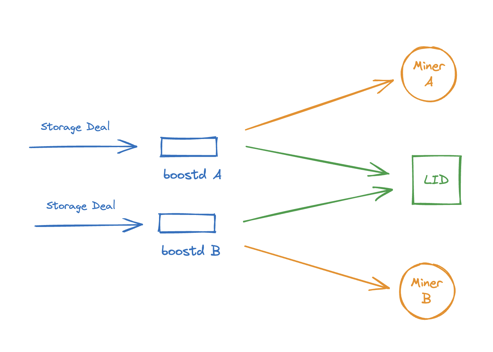
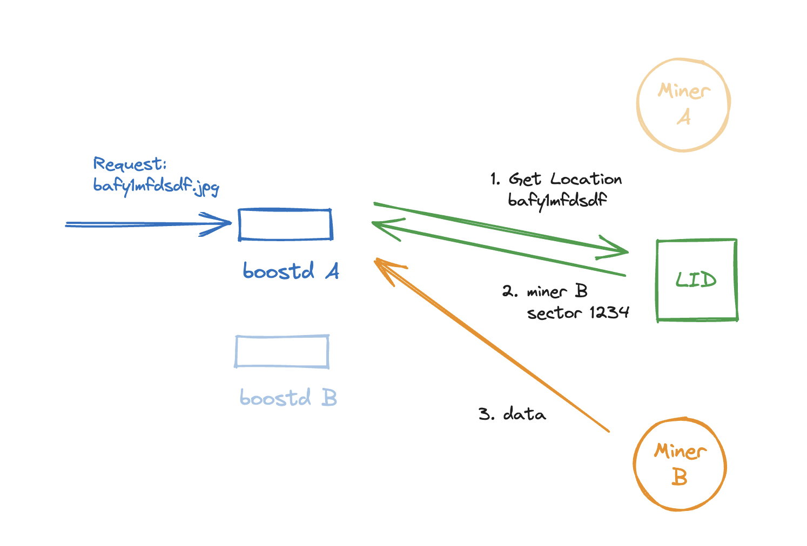
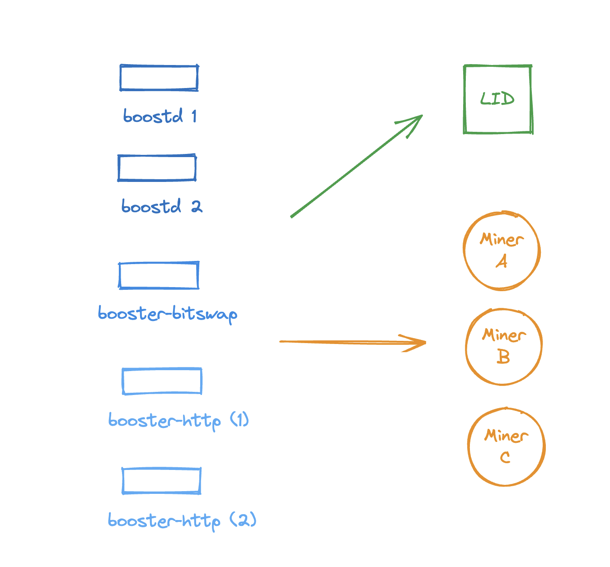

# How to upgrade from Boost v1 to Boost v2


Make sure you have read the [**Components**](../deployment.md) page before proceeding. Boost v2 introduces a new service called **boostd-data** which requires a database to be installed - YugabyteDB or LevelDB.


## Introduction

Boost v2 introduces the Local Index Directory as a replacement for the DAG store. It scales horizontally and provides a more intuitive experience for users, by surfacing problems in the UI and providing repair functionality.

<figure><figcaption></figcaption></figure>

### Architecture

When boost receives a storage deal, it creates an index of all the block locations in the deal data, and stores the index in LID.

When boostd / booster-http etc gets a request for a block it:

* gets the block sector and offset from the LID index
* requests the data at that sector and offset from the miner



A large miner with many incoming retrieval requests needs many boostd / booster-http / booster-bitswap processes to serve those requests. These processes need to look up block locations in a centralized index.

We tested several databases and found that YugabyteDB is best suited to the indexing workload because

* it performs well on off-the-shelf hardware
* it's easy to scale up by adding more machines
* it has great documentation
* once set up, it can be managed through a web UI

### Connecting multiple boost instances to a single LID

It is possible to connect multiple boostd instances to a single LID instance.
In this scenario, each boostd instance still stores data to a single miner.
eg boostd A stores data to miner A, boostd B stores data to miner B.
However each boostd instance saves retrieval indexes in a single, shared LID instance.



For retrieval, each boostd instance can query the shared LID
instance (to find out which miner has the data) and retrieve data from any miner
in the cluster.



booster-bitswap and booster-http can also be configured to query the shared LID
instance, and retrieve data from any miner in the cluster.




If you are deploying multiple boost instances with a single LID
instance you will need to set up the networking so that each boost instance
can query all miners in the cluster. We recommend assigning all of your miner instances and boostd instances to the same subnet.
Note also that the Yugabyte DB instance will need enough space for retrieval
indexes for all of the miners.



## Prerequisites

### Install YugabyteDB

The Local Index Directory stores retrieval indices in a YugabyteDB database. Retrieval indices store the size and location of each block in the deal data.

We recommend running YugabyteDB on a dedicated machine with SSD drives. Depending on how many blocks there are in the user data, the retrieval indices may require up to 2% of the size of the unsealed data. e.g. 1 TiB of unsealed user data may require a 20 GiB index.

YugabyteDB should require about the same amount of space as your DAG store requires today.

You can find more information about YugabyteDB in the `Components` section:


[yugabytedb.md](../components/yugabytedb.md)


## Instructions

Follow these instructions in order to migrate your existing DAG store into the new Local Index Directory and upgrade from Boost v1 to Boost v2:

**1. Clone the Boost repository to a temporary directory**

Note: Don’t overwrite your existing boost instance at this stage

```
cd /tmp
git clone https://github.com/filecoin-project/boost.git boostv2
cd boostv2
```

**2. Check out the Boost v2 release**

```
git checkout v2.x.x
```

**3. Build from source**

```
make
```

**4. Migrate dagstore indices**

Depending on the amount of data your SP is storing, this step could take anywhere from a few minutes to a few hours. You can run it even while Boost v1 continues to run. The command can be stopped and restarted. It will continue from where it left off.

Run the migration with parameters to connect to YugabyteDB on its Cassandra and PostgreSQL interfaces:

```
./migrate-lid yugabyte \
  --hosts <yugabytedb-hosts> \
  --connect-string="postgresql://<username>:<password>@<yugabytedb>:5433" \
  dagstore
```

It will output a progress bar, and also a log file with detailed migration information at `migrate-yugabyte.log`


If you are deploying a single LID instance with multiple boost instances, you will
need to repeat this step for each boost instance in the cluster.



**5. Run the `boostd-data` service**

`boostd-data` is a data proxy service which abstracts the access to LID through an established interface. It makes it easier to secure the underlying database and not expose it. `boostd-data` listens to a websocket interface, which is the entrypoint which should be exposed to `boostd`, and`booster-http`

Start the `boostd-data` service with parameters to connect to YugabyteDB on its Cassandra and PostgreSQL interfaces:

```
./boostd-data run yugabyte \
  --hosts <yugabytedb-hosts> \
  --connect-string="postgresql://<username>:<password>@<yugabytedb>:5433" \
  --addr 0.0.0.0:8044
```


\--hosts takes the IP addresses of the YugabyteDB YT-Servers separated by ","\
Example:

&#x20;\-- hosts 10.0.0.1,10.0.0.2,10.0.0.3

\
\--addr is the \<IP>:\<PORT> where `boostd-data` service should be listening on. The IP here can be a private one (recommended) and should reachable by all boost related processes. Please ensure to update your firewall configuration accordingly.

If you are deploying a single LID instance with multiple boost instances, you should
run a single boostd-data process. All boost instances should be able to reach this
single boostd-data process.



**6. Update `boostd` repository config**

Configure `boostd` repository config (located at `<boostd repo>/config.toml`) to point to the exposed `boostd-data` service endpoint. Note that the connection must be configured to go over a websocket.

For example:

```
[LocalIndexDirectory]
  ServiceApiInfo = "ws://<boostd-data>:8044"
```

**6.1 Add miners to `boostd` repository config**

If you are deploying a single LID instance with multiple boost instances, you will
also need to add to config the RPC endpoint for each miner in the cluster.
This allows boostd to serve data for each miner over Graphsync.

```
[DealMaking]
  GraphsyncStorageAccessApiInfo = [
    # Make sure to include the miner that this boostd instance
    # stores data to, as well as the other miners.
    # Use `lotus-miner auth api-info` to get the RPC API connect string.
    "<auth token>:/ip4/<ip>/tcp/2345/http",
    "<auth token>:/ip4/<ip>/tcp/2345/http"
  ]
```

Make sure to test that this boostd instance can reach each miner by running
```
$ MINER_API_INFO=<auth token>:/ip4/<ip>/tcp/2345/http lotus-miner info
```

**7. Install Boost v2**

```
make install
```

Note that in v2 `booster-http` and `booster-bitswap` take slightly different parameters (see below).

**8. Stop `boostd`, `booster-http` and `booster-bitswap`**

You need to stop `boostd` before migrating `piece info` data.

**9. Migrate piece info data (information about which sector each deal is stored in)**

This should take no more than a few minutes.

```
./migrate-lid yugabyte \
  --hosts <yugabytedb-hosts> \
  --connect-string="postgresql://<username>:<password>@<yugabytedb>:5433" \
  pieceinfo
```

**10. Start the upgraded versions of `boostd`, `booster-http` and `booster-bitswap`**

Note that `booster-http` and `booster-bitswap` take slightly different parameters:

* `--api-boost` is removed
* There is a new parameter `--api-lid` that points to the `boostd-data` service (which hosts LID), e.g. `--api-lid="ws://<boostd-data>:8044"`
* If you are deploying a single LID instance with multiple boost instances, you should supply a `--api-storage` flag for each one
  * eg `--api-storage=MINER_API_INFO_1 --api-storage=MINER_API_INFO_2`
  * Make sure to test that this booster-http / booster-bitswap instance can reach each miner by running
    ```
    $ MINER_API_INFO=MINER_API_INFO_1 lotus-miner info
    ```


**11. Clean up the dagstore directory from `boostd` repo and the temporary boost github repo**


Be careful when running the below command to ensure that you do not remove incorrect directory\
\
$ rm -rf \<boostd repo>/dagstore

$ rm -rf /tmp/boostv2


## Verify the setup

**1. Test how long it takes to reindex a piece**

```
time boostd lid gen-index <piece CID>
```

**2. Perform a retrieval using Graphsync, Bitswap and HTTP**

```
boost retrieve --provider=<miner id> -o output.dat <cid>
```

## Conclusion

At this stage you should have the latest version of Boost running with the Local Index Directory. Go to the **Local Index Directory** page and review the number sections:

#### Pieces

<figure><figcaption></figcaption></figure>

Pieces section shows counters for total pieces of user data that your SP is storing as well as whether you are keeping _unsealed_ and _indexed_ copies of them.

#### Flagged pieces

<figure><figcaption></figcaption></figure>

_Flagged pieces_ are pieces that either lack an unsealed copy or are missing an index. For the sealed-only user data, you should make sure that you unseal individual sectors if you want this data to be retrievable.

_Sealed only_ copies of data are not retrievable and are only being proven on-chain within the corresponding _deadline_ / _window_. Typically sealed only data is considered as archival as it is not immediately retrievable. If the client requests it, the SP sealing pipeline must first unseal it, which typically takes 1-2 hours, and only then the data becomes available.

_Flagged (unsealed)_ pieces is user data that your SP is hosting, which is not indexed.


We recommend that you trigger re-indexing for these pieces, so that data becomes retrievable. Check the [tutorial on re-indexing flagged unsealed pieces](how-to-re-index-unsealed-pieces-that-are-flagged-by-lid-in-boost-v2.md) for more information.


#### Deal Sector Copies

<figure><figcaption></figcaption></figure>

Deal Sector Copies section displays counters of your sectors state - whether you keep unsealed copies for all sectors or not. Ideally the SP should keep unsealed copies for all data that should be immediately retrievable.

#### Sector Proving State

<figure><figcaption></figcaption></figure>

Sector Proving State section displays counters of your active and inactive sectors - active sectors are those that are actively proven on-chain, inactive sectors are those that you might have failed to publish a _WindowPoSt_ for, or are expired or removed.
