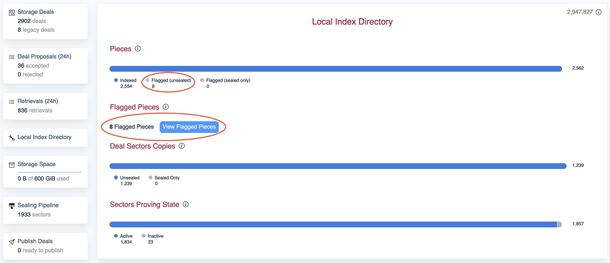

# How to re-index unsealed pieces that are flagged by LID in Boost v2

As explained in the tutorial [how to upgrade from Boost v1 to Boost v2](how-to-migrate-boost-v1-to-boost-v2.md), in Boost v2 the Local Index Directory periodically checks all pieces that the SP stores and confirms if there exists an _unsealed copy_ of the data and whether it is _indexed_. If the index is missing, the piece is _flagged_, meaning that the operator of the SP should fix it if they wish to make it retrievable.

<figure><figcaption></figcaption></figure>

Fixing individual flagged unsealed pieces from the Boost Web UI is possible directly from the Web UI.

If the SP has a lot of flagged pieces, you can automate the re-indexing of pieces with the following commands:

#### Fetch the `piececid`s of all the flagged unsealed pieces from LID


```
// GraphQL query to get the first 1000 flagged unsealed pieces from LID.
// If you have more than 1000 flagged unsealed pieces, you need to modify the query
// and adjust the pagination parameters

curl -X POST -H "Content-Type: application/json" -d '{"query":"query { piecesFlagged(hasUnsealedCopy: true, limit: 2) { totalCount pieces { CreatedAt PieceCid IndexStatus { Status Error } } } }" }' http://localhost:8080/graphql/query | jq ".data.piecesFlagged.pieces[] | .Piece.PieceCid"
```


#### Trigger re-indexing of each `piececid`

```
// Re-index a specific piececid.
// Assumes that the piececid has an unsealed copy.

boostd lid gen-index <piececid>
```
